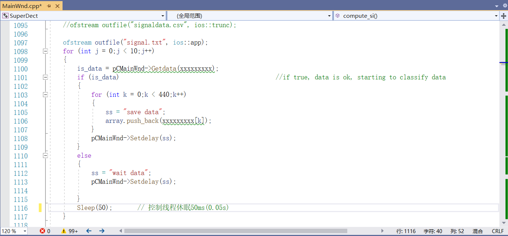

# 超声点云数据采集系统

本系统用于采集复合材料的超声点云数据，主要包括超声无损检测模块和机械臂控制模块等。

## 超声无损检测模块

- 该模块用于实时显示与采集被检测目标的超声A扫信号。

 文件夹名称  


该文件为硕德公司提供的“UFD BOX-LV”设备的SDK包。  

语言为C++，需要在Visual Studio软件中运行，下图为其常规属性。


**运行方式：**  

 1、双击打开文件：  ./SuperDect.sln  


 2、在Visual Studio软件中点击运行程序   
  

 3、忽略异常，继续运行  
   
  

 4、进入到超声无损检测软件界面，进行调试，实现超声A扫信号的正确显示。


 5、超声A扫信号原始数据保存地址： 
```
./data/ultrasonic_coding.txt——超声编码

./data/ultrasonic_data.csv——超声原始信号（通过超声编码对应起来）
```
6、保存数据的代码（目前设置的为：长度440，时间间隔50ms）：


## JAKA机械臂控制模块
- 该模块用于控制JAKA机械臂，并实时提取机械臂位置信息。  

文件夹名称： JAKA_Zu   


该机械臂为节卡公司的JAKA Zu7六自由度机械臂：  


**机械臂运行方式：**

1、给设备上电

2、安装相应软件   


3、进入软件界面    
  
注：先连接WiFi——CAB7210486；再在软件中连接设备，设备密码为——jakazuadmin

4、进入手动操作界面，将设备移动至预定位置     


5、设置坐标系——用户坐标系、工具坐标系（如图中，在空间上显示的红绿蓝三轴）  
用户坐标系的设置：设置-操作设置-用户坐标系-选择一个编辑-三点设置     


6、进入编程控制界面，编写机械臂运动轨迹的代码，如图:


7、实时获取机械臂位置信息（三维坐标XYZ；旋转角RX-RY-RZ）
```
原始程序位置：./JAKA_Zu/load_program_save_tcp.py

运行方式：python load_program_save_tcp.py

数据保存位置：./JAKA_Zu/test.txt
```
代码：


## 超声信号及三维空间坐标链接模块
###  超声+机械臂

实时获取机械臂位置信息（三维坐标XYZ；旋转角RX-RY-RZ），以及超声编码
```
程序位置：./Save_ultrasonic_robot.py

运行方式：python Save_ultrasonic_robot.py

数据保存位置：./data/ultrasonic_robot.csv
```
- 详细见代码：Save_ultrasonic_point.py


###  双目相机+机械臂

基于YOLOv5算法来识别跟踪点，利用intel提供的双目相机获取相应位置的三维信息。

实现实时采集跟踪点位置信息（三维坐标XYZ），以及超声编码。
```
程序位置：./yolov5-master/rstest_ultrasonic_camera.py

运行方式：python rstest_ultrasonic_camera.py

数据保存位置：./data/ultrasonic_camera.csv
```
- 详细见代码：rstest_ultrasonic_camera.py       


## 数据保存文件
data文件夹为数据保存文件夹，数据文件有4个，分别为：
```
- ultrasonic_camera.csv——超声编码及双目相机三维坐标数据
- ultrasonic_coding.txt——超声编码
- ultrasonic_data.csv——超声原始信号（通过超声编码对应起来）
- ultrasonic_robot.csv——超声编码及机械臂三维坐标数据
```

